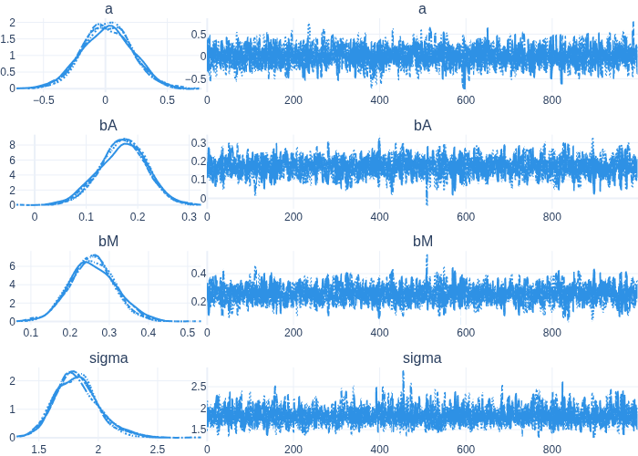

# 🚒 firetruck

!!! NOTE: This repo is just an experiment for now, not ready for any kind of serious use. The package is not published on PyPI either !!!

firetruck is NumPyro dialect for mental midgets. This means:

 - No `numpyro.deterministic` and `numpyro.sample`, just write your code like a normal human, and assign variables you want to track to `self`
 - You can just return your outcome variable from the function, no `obs` bullshit!
 - Greatly simplified sampling and VI. No bespoke solutions, just good defaults for 90% of your use cases.
 - You can deal with latent categorical variables without having to do anything, yaaay!
 - No Arviz, no matplotlib, just some trusty, modifiable Plotly plots. It ain't much, but it'll get you most of the way.

## Example

I modified the Waffle House example in the [NumPyro docs](https://num.pyro.ai/en/stable/tutorials/bayesian_regression.html) to use firetruck.

```python
import jax as jax
import jax.numpy as jnp
import numpyro.distributions as dist
import pandas as pd

import firetruck as ftr

DATASET_URL = "https://raw.githubusercontent.com/rmcelreath/rethinking/master/data/WaffleDivorce.csv"
dset = pd.read_csv(DATASET_URL, sep=";")
marriage = jnp.array(dset["Marriage"])
divorce = jnp.array(dset["Divorce"])
age = jnp.array(dset["MedianAgeMarriage"])


# Don't forget this decorator!! Very important
@ftr.compact
def model(self, marriage, age):
    # Just assign variables to self that you want to track,
    # And they will be named automatically!!
    self.a = dist.Normal(0.0, 0.2)
    self.bM = dist.Normal(0.0, 0.5)
    self.bA = dist.Normal(0.0, 0.5)
    self.sigma = dist.Exponential(0.5)
    mu = self.a + self.bM * marriage + self.bA * age
    return dist.Normal(mu, self.sigma)


# Sampling Prior predictive distribution
rng_key = jax.random.key(42)
rng_key, subkey = jax.random.split(rng_key)
prior_predictive = model.add_input(marriage, age).sample_predictive(subkey)

# Add inputs to the model and condition on the output
conditioned_model = model.add_input(marriage, age).condition_on(divorce)

# Fit model using meanfield VI
rng_key, subkey = jax.random.split(rng_key)
res = conditioned_model.meanfield_vi(subkey)

# Sample from model using NUTS
rng_key, subkey = jax.random.split(rng_key)
mcmc = conditioned_model.sample_posterior(subkey)

# Prints this automatically, cause why the hell would you not need this:
#                 mean       std    median      5.0%     95.0%     n_eff     r_hat
#          a      0.01      0.20      0.02     -0.31      0.35   2348.61      1.00
#         bA      0.17      0.05      0.17      0.10      0.25   1634.25      1.00
#         bM      0.26      0.06      0.26      0.16      0.35   1649.36      1.00
#      sigma      1.82      0.19      1.81      1.52      2.11   2419.83      1.00
#
# Number of divergences: 0

# Plot sampling trace
fig = ftr.plot_trace(mcmc)
fig.show()
```


